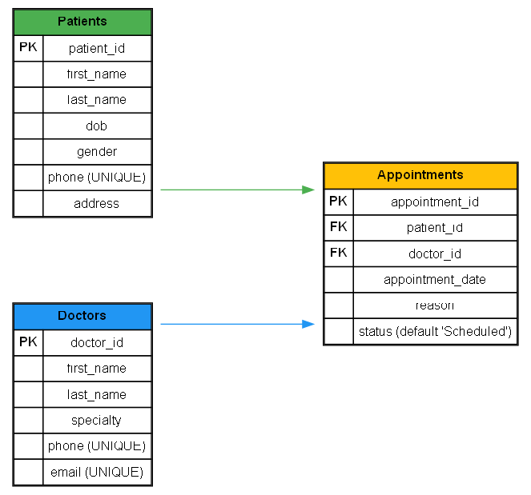

# 🏥 Hospital Database – Basic SELECT Queries

## 📌 Introduction
This is a small practice project for learning **SQL SELECT queries**.  
Domain chosen: **Hospital Management System** (Patients, Doctors, Appointments).

We practice:
- `SELECT *` and choosing specific columns
- Filtering with `WHERE`, `AND`, `OR`, `LIKE`, `BETWEEN`
- Sorting with `ORDER BY`
- Limiting rows with `LIMIT`

## 🚀 How to Run
1. Open **DB Browser for SQLite** (or SQLiteStudio).
2. Create a new database `hospital.db`.
3. Execute `schema.sql` to create tables.
4. Execute `data.sql` to insert sample data.
5. Execute `queries.sql` to try out the examples.

## 📂 Files
- `schema.sql` → Database schema (tables + relationships)
- `data.sql` → Sample hospital dataset
- `queries.sql` → Example SELECT queries
- `docs/hospital-er-diagram.png` → ER Diagram

## 📊 ER Diagram
Here’s how everything is connected:

## ✅ Outcome
After this, you’ll understand:
- How to retrieve data
- How to filter, sort, and limit results
- Basics of working with real-world-style hospital data
